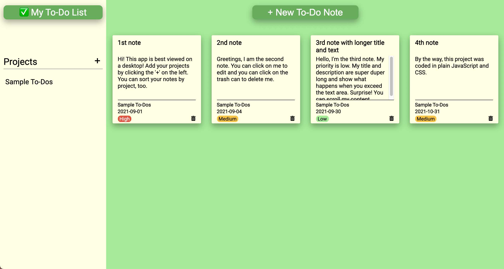
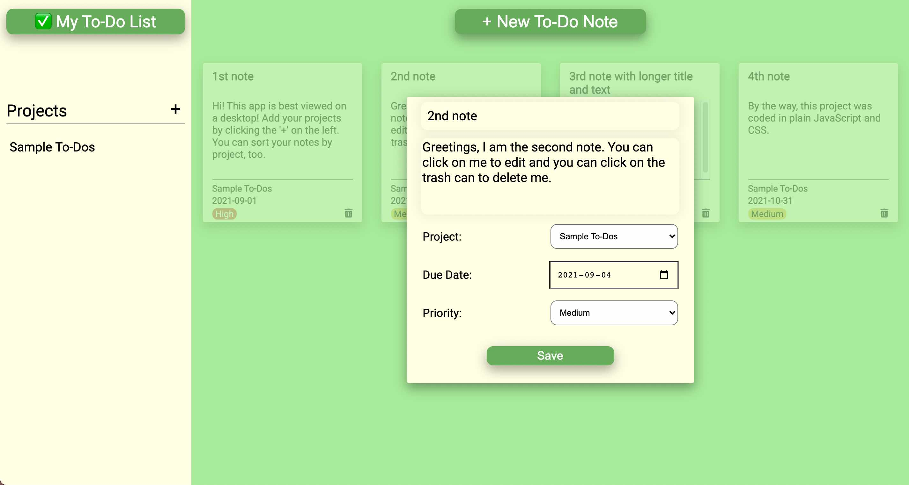

# ✅ To-Do List app project  

&nbsp;&nbsp;&nbsp; 

Date completed: November 5, 2021  

**Best viewed on 🖥 desktop!**  

**See it live at (https://rusty-reebs.github.io/to-do-list/)!**  

Objectives: use JavaScript to dynamically create objects, keep logic in separate modules, and use localStorage to save user's projects and to-dos between sessions.  

### Screenshots
-----

### TIL Things I Learned
-----

- this was a complex project with a lot of moving parts!
- practiced storing, manipulating, and retrieving data from multiple arrays
- practiced using array methods like `.splice`, `.map`, `.forEach`, and `.filter`
- event bubbling
- how to use CSS grid effectively

